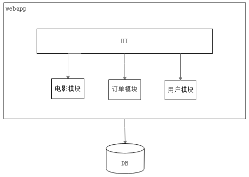

# 1.1 单体应用架构存在的问题

一个归档包（例如war格式）包含了应用所有功能的应用程序，我们通常称之为单体应用。架构单体应用的方法论，我们称之为单体架构。

我们以一个电影售票系统为例，如果采用单体架构，它的架构图如图所示。

图1-1 单体架构示意图

由图我们可以看到，UI和若干业务模块都被打包在一个war包中，该war包包含了整个系统所有的功能。尽管应用本身也进行了模块化，但是它最终还是会打包并部署为一个单体应用。

相信很多项目都是从单体应用开始的。单体应用比较容易部署、测试，在项目的初期，单体应用都可以很好地运行。然而，随着需求的不断增加，越来越多的人加入开发团队，代码库也在飞速地膨胀。慢慢地，单体应用变得越来越臃肿，可维护性、灵活性降低，维护成本越来越高。下面列举单体应用存在的一些问题：

* 技术债务

随着时间推移、需求变更和人员更迭，形成应用程序的技术债务，并且越积越多。“不坏不修（Not broken，don’t fix）”，这在软件开发中非常常见，在单体应用中这种思想更甚。已使用的系统设计或代码难以修改，因为应用程序的其他模块可能会以意料之外的方式使用它。

* 复杂性高

以笔者经手的一个百万行级别的单体应用为例，整个项目包含的模块非常多，模块的边界模糊，依赖关系不清晰，多处存在循环依赖……整个项目非常复杂。每次修改代码都心惊胆战，甚至添加一个简单的功能，或者修改一个BUG都会造成隐含的缺陷。

* 交付周期长

随着代码的增多，构建和部署的时间也会增加。每次功能的变更或者缺陷的修复都会导致我们需要重新部署整个应用。这种部署方式耗时长、影响的范围大、风险高，这使得单体项目的部署频率较低，交付周期长。而交付周期长又导致了两次发布之间会有大量的功能或者缺陷需要变更，出错概率比较高。

* 扩展能力受限

单体应用只能作为一个整体进行扩展，无法结合业务模块的特点进行伸缩。例如：应用中有的模块是计算密集型的，它需要强劲的CPU；有的模块是IO密集型的，需要更大的内存，由于这些模块部署在一起，我们不得不在硬件的选择上做出妥协。

* 阻碍技术创新

单体应用往往使用统一的技术平台或方案解决所有问题，每个团队成员都必须使用相同的开发语言及开发框架。然而，技术是不断在发展的，近几年也不断有开发效率更高、性能更好的新技术出现。如果想要尝试使用引入新的框架或技术会非常困难。例如：假设一个100万行的单体应用，原本是使用Struts2构建的，如果现在想要使用Spring MVC，切换成本无疑是非常高的。

综上，随着业务需求的发展，功能的不断增加，单体架构很难满足业务快速变化的需要。一方面，代码的可维护性、灵活性、可扩展性在降低；另一方面运维、测试的成本在增加。

如何解决单体架构存在的问题呢？