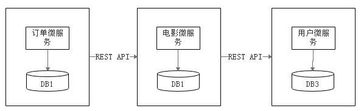

# 1.3 什么是微服务

微服务是当前非常热门的话题，它在各种演讲、书籍的出镜率非常高。到底什么是微服务呢？

从业界的讨论看，微服务本身并没有一个严格的定义。大神Martin Fowler在他的博客中是这样描述微服务的，比较。

> In short, the microservice architectural style is an approach to developing a single application as a suite of small services, each running in its own process and communicating with lightweight mechanisms, often an HTTP resource API. These services are built around business capabilities and independently deployable by fully automated deployment machinery. There is a bare minimum of centralized management of these services, which may be written in different programming languages and use different data storage technologies.
>

翻译一下：简而言之，微服务架构风格这种开发方法，是以开发一组小型服务的方式来开发一个独立的应用系统的。其中每个小型服务都运行在自己的进程中，并经常采用HTTP资源API这样轻量的机制来相互通信。这些服务围绕业务功能进行构建，并能通过全自动的部署机制来进行独立部署。这些微服务可以使用不同的语言来编写，并且可以使用不同的数据存储技术。对这些微服务我们仅做最低限度的集中管理。

从中我们可以看到，微服务架构大致具备以下特点：

1. 每个微服务可独立运行在自己的进程里；
2. 一系列独立运行的微服务共同构建起了整个系统；
3. 每个服务为独立的业务开发，一个微服务一般完成某个特定的功能，比如：订单管理、用户管理等；
4. 微服务之间通过一些轻量的通信机制进行通信，例如通过REST API或者RPC的方式进行调用。

我们还以电影收票系统为例，如使用微服务架构，架构图如图1-2所示。

图1-2 微服务架构示意图

我们可以看到，我们将整个应用分解为3个微服务。每个微服务都运行在自己的进程中，都可以独立地运行；每个微服务分别有自己的数据库；微服务之间以REST API进行通信。

