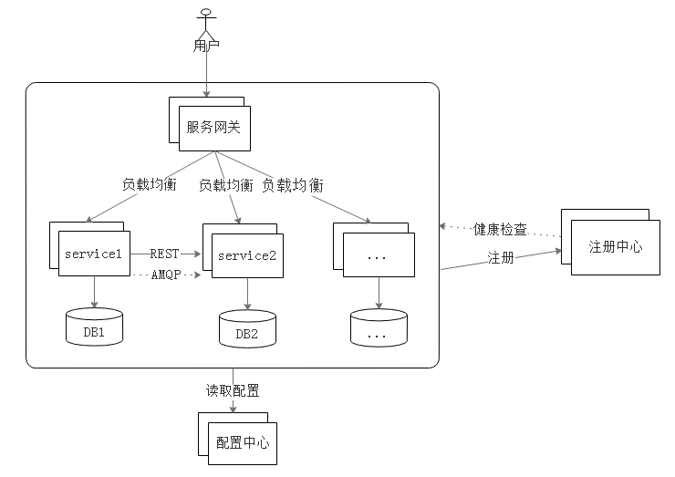

# 1.6.2 微服务架构图及常用组件

在进入实战之前，我们首先展望一下，看一下一个微服务架构的最终架构图是什么样子的。

图1-3 微服务架构图

图1-3不严谨地表示了一个微服务应用的架构（之所以说不严谨，是因为配置中心可以注册到注册中心上；而注册中心也可以从配置中心读取配置信息）。

由图我们可以看到，除了业务所需要的service1、service2等业务相关的微服务以外，还有注册中心、服务网关、配置中心等组件。

配置中心大家很好理解，是一个用于管理配置的微服务。可注册中心、服务网关是什么？作用又是什么？我们将在实战的过程中进行具体的讲解。