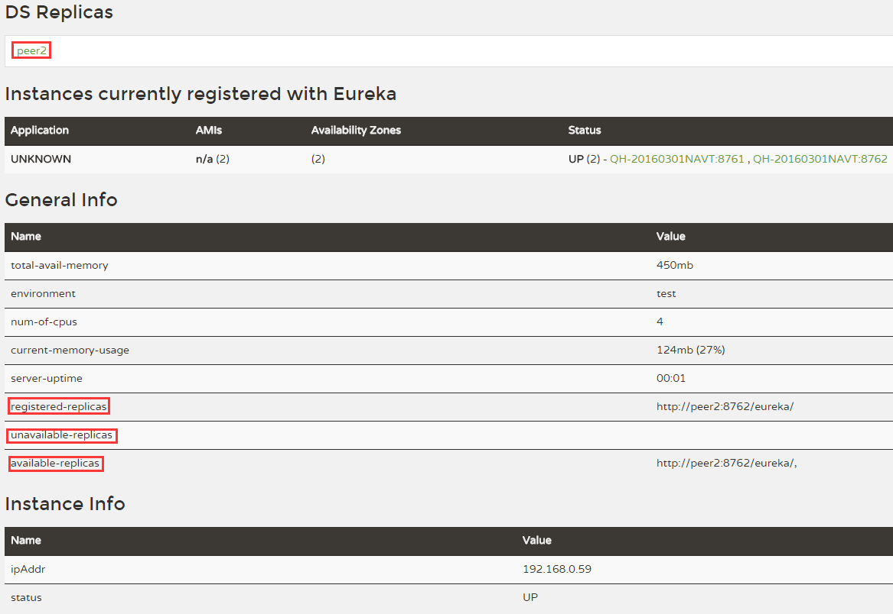

# 2.1.2 Eureka的高可用

按照前文对Eureka的讲解，我们即可构建出一个简单的注册中心。但此时的Eureka是单点的，不适合于生产环境，那么如何实现Eureka的高可用呢？


* 添加主机名：

```shell
127.0.0.1 peer1 peer2
```
* 修改application.yml

```yaml
---
spring:
  profiles: peer1                                 # 指定profile=peer1
server:
  port: 8761
eureka:
  instance:
    hostname: peer1                               # 指定当profile=peer1时，主机名
  client:
    serviceUrl:
      defaultZone: http://peer2:8762/eureka/      # 将自己注册到peer2这个Eureka上面去

---
spring:
  profiles: peer2
server:
  port: 8762
eureka:
  instance:
    hostname: peer2
  client:
    serviceUrl:
      defaultZone: http://peer1:8761/eureka/
```
* 分别启动两个Eureka应用：

```shell
java -jar microservice-discovery-eureka-0.0.1-SNAPSHOT.jar --spring.profiles.active=peer1
java -jar microservice-discovery-eureka-0.0.1-SNAPSHOT.jar --spring.profiles.active=peer2
```
* 访问`http://peer1:8761` ，我们会发现`registered-replicas` 中已经有`peer2` 节点了，同样地，访问`http://peer2:8762` ，也能发现其中的`registered-replicas`  有`peer1` 节点，如下图：



* 我们尝试将`peer2` 节点关闭，然后访问`http://peer1:8761` ，会发现此时peer2会被添加到`unavaliable-replicas` 一栏中。


注意：

> 该示例中的`hostname` 并非必须的，如果不配置，默认将会使用IP进行查找。


## 将服务注册到高可用的Eureka

如果注册中心是高可用的，那么各个微服务配置只需要将`defaultZone` 改为如下即可：

```yaml
eureka:
  client:
    serviceUrl:
      defaultZone: http://peer1:8761/eureka/,http://peer2:8762/eureka
```


## 参考文档

> [http://cloud.spring.io/spring-cloud-static/Brixton.SR5/#spring-cloud-eureka-server](http://cloud.spring.io/spring-cloud-static/Brixton.SR5/#spring-cloud-eureka-server)


