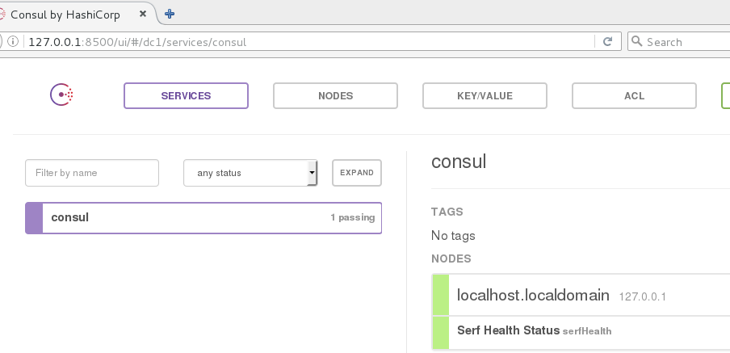

# 2.1.4 Consul安装与使用


## 准备工作

一台CentOS 7 机器，输入`ifconfig` ，查看网卡信息如下：

```
eno16777736: flags=4163<UP,BROADCAST,RUNNING,MULTICAST>  mtu 1500
        inet 192.168.11.143  netmask 255.255.255.0  broadcast 192.168.11.255
        inet6 fe80::20c:29ff:fe89:6b91  prefixlen 64  scopeid 0x20<link>
        ether 00:0c:29:89:6b:91  txqueuelen 1000  (Ethernet)
        RX packets 752526  bytes 705406371 (672.7 MiB)
        RX errors 0  dropped 0  overruns 0  frame 0
        TX packets 142062  bytes 18646825 (17.7 MiB)
        TX errors 0  dropped 0 overruns 0  carrier 0  collisions 0

lo: flags=73<UP,LOOPBACK,RUNNING>  mtu 65536
        inet 127.0.0.1  netmask 255.0.0.0
        inet6 ::1  prefixlen 128  scopeid 0x10<host>
        loop  txqueuelen 0  (Local Loopback)
        RX packets 172  bytes 1003766 (980.2 KiB)
        RX errors 0  dropped 0  overruns 0  frame 0
        TX packets 172  bytes 1003766 (980.2 KiB)
        TX errors 0  dropped 0 overruns 0  carrier 0  collisions 0
```

我们可以看到，该机器有两个IP：

```
192.168.11.143
127.0.0.1
```


## Consul的安装与启动

* 安装Consul（以CentOS7为例）：

```shell
cd /usr/local/bin/
wget https://releases.hashicorp.com/consul/0.7.0/consul_0.7.0_linux_amd64.zip
unzip consul0.7.0linux_amd64.zip
```
得到`consul` 文件，这样就完成了安装。

* 启动Consul

```shell
./consul agent -dev           # -dev表示开发模式运行，另外还有-server表示服务模式运行
```
* 输入`http://127.0.0.1:8500/ui/` 访问Consul，可查看到如下界面：

4. 我们尝试访问`http://192.168.11.143/ui/` ，会发现无法访问。说明Consul还不能被远程访问。那么如何设置才能被远程访问呢？Consul如何高可用呢？


