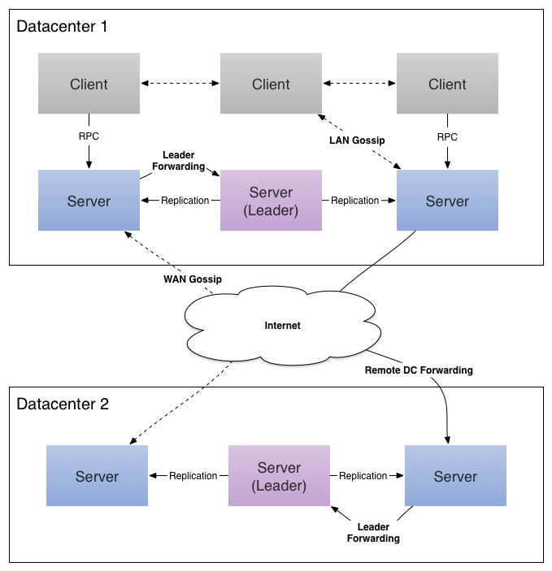
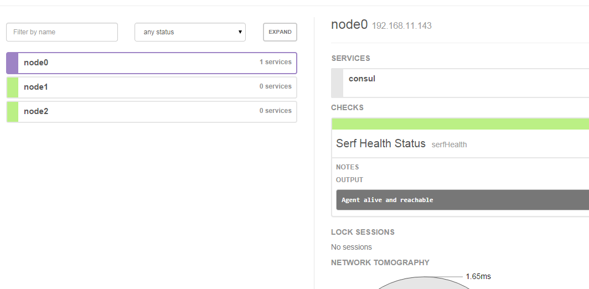

# 2.1.6 Consul 的高可用

Consul Cluster集群架构图如下：




这边准备了三台CentOS 7的虚拟机，主机规划如下，供参考：

| 主机名称  | IP             | 作用            | 是否允许远程访问 |
| ----- | -------------- | ------------- | -------- |
| node0 | 192.168.11.143 | consul server | 是        |
| node1 | 192.168.11.144 | consul client | 否        |
| node2 | 192.168.11.145 | consul client | 是        |


## 搭建步骤：

* 启动node0机器上的Consul（node0机器上执行）：

```shell
consul agent -data-dir /tmp/node0 -node=node0 -bind=192.168.11.143 -datacenter=dc1 -ui -client=192.168.11.143 -server -bootstrap-expect 1
```
* 启动node1机器上的Consul（node1机器上执行）：

```shell
consul agent -data-dir /tmp/node1 -node=node1 -bind=192.168.11.144 -datacenter=dc1 -ui
```
* 启动node2机器上的Consul（node2机器上执行）：

```shell
consul agent -data-dir /tmp/node2 -node=node2 -bind=192.168.11.145 -datacenter=dc1 -ui -client=192.168.11.145
```
* 将node1节点加入到node0上（node1机器上执行）：

```shell
consul join 192.168.11.143
```
* 将node2节点加入到node0上（node2机器上执行）：

```shell
consul join -rpc-addr=192.168.11.145:8400  192.168.11.143
```
* 这样一个简单的Consul集群就搭建完成了，在node1上查看当前集群节点：

```shell
consul members -rpc-addr=192.168.11.143:8400
```

结果如下：

```shell
Node   Address              Status  Type    Build  Protocol  DC
node0  192.168.11.143:8301  alive   server  0.7.0  2         dc1
node1  192.168.11.144:8301  alive   client  0.7.0  2         dc1
node2  192.168.11.145:8301  alive   client  0.7.0  2         dc1
```
说明集群已经搭建成功了。

我们分析一下，为什么第5步和第6步需要加`-rpc-addr` 选项，而第4步不需要加任何选项呢？原因是`-client` 指定了客户端接口的绑定地址，包括：HTTP、DNS、RPC，而`consul join` 、`consul members` 都是通过RPC与Consul交互的。


## 访问集群

如上，我们三个节点都加了`-ui` 参数启动了内建的界面。我们可以通过：`http://192.168.11.143:8500/ui/` 或者`http://192.168.11.145:8500/ui/`进行访问，也可以在node1机器上通过`http://127.0.0.1:8500/ui/` 进行访问，原因是node1没有开启远程访问 ，三种访问方式结果是一致的，如下：




## 参考文档：
>  Consul官方文档：[https://www.consul.io/intro/getting-started/install.html](https://www.consul.io/intro/getting-started/install.html)
>
>  Consul 系列博文：[http://www.cnblogs.com/java-zhao/archive/2016/04/13/5387105.html](http://www.cnblogs.com/java-zhao/archive/2016/04/13/5387105.html)
>
>  使用consul实现分布式服务注册和发现：[http://www.tuicool.com/articles/M3QFven](http://www.tuicool.com/articles/M3QFven)


