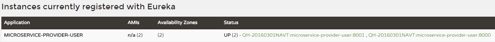

# 2.3 服务消费者

上文我们创建了注册中心，以及服务的提供者microservice-provider-user，并成功地将服务提供者注册到了注册中心上。

要想消费microservice-provider-user的服务是很简单的，我们只需要使用RestTemplate即可，或者例如HttpClient之类的http工具也是可以的。但是在集群环境下，我们必然是每个服务部署多个实例，那么服务消费者消费服务提供者时的负载均衡又要如何做呢？

## 准备工作

1. 启动注册中心：microservice-discovery-eureka
2. 启动服务提供方：microservice-provider-user
3. 修改microservice-provider-user的端口为8001，另外启动一个实例

此时，访问[http://discovery:8761](http://discovery:8761)

可以在Eureka中看到microservice-provider-user有两个实例在运行。

下面我们创建一个新的微服务（microservice-consumer-movie-*），负载均衡地消费microservice-provider-user的服务。