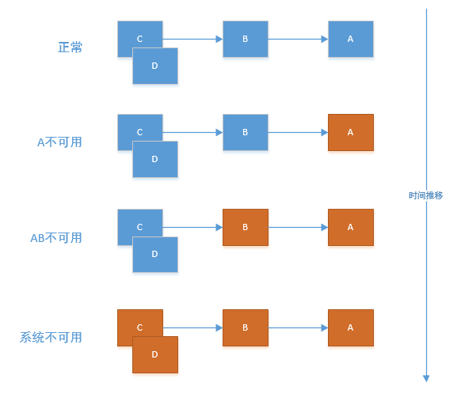
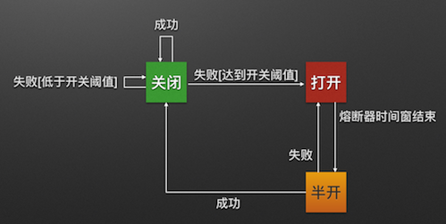

# 2.4 熔断器

## 雪崩效应

在微服务架构中通常会有多个服务层调用，基础服务的故障可能会导致级联故障，进而造成整个系统不可用的情况，这种现象被称为服务雪崩效应。服务雪崩效应是一种因“服务提供者”的不可用导致“服务消费者”的不可用,并将不可用逐渐放大的过程。

如果下图所示：A作为服务提供者，B为A的服务消费者，C和D是B的服务消费者。A不可用引起了B的不可用，并将不可用像滚雪球一样放大到C和D时，雪崩效应就形成了。

## 熔断器（CircuitBreaker）

熔断器的原理很简单，如同电力过载保护器。它可以实现快速失败，如果它在一段时间内侦测到许多类似的错误，会强迫其以后的多个调用快速失败，不再访问远程服务器，从而防止应用程序不断地尝试执行可能会失败的操作，使得应用程序继续执行而不用等待修正错误，或者浪费CPU时间去等到长时间的超时产生。熔断器也可以使应用程序能够诊断错误是否已经修正，如果已经修正，应用程序会再次尝试调用操作。

熔断器模式就像是那些容易导致错误的操作的一种代理。这种代理能够记录最近调用发生错误的次数，然后决定使用允许操作继续，或者立即返回错误。

熔断器开关相互转换的逻辑如下图：

