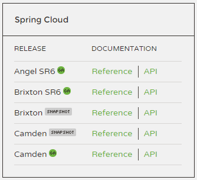

# 2.2 Spring Cloud的版本简介

目前Spring绝大多数项目的版本命名方式一般是以`主版本号.次版本号.增量版本号.里程碑版本号` 这种方式命名的，这是Maven较为推崇的版本命名方式。例如Spring最新的稳定版本`4.3.3.RELEASE` ，或者里程碑版本`5.0.0.M2` 等。

我们来看一下Spring Cloud的版本：

我们可以发现Spring Cloud的版本是以`单词 SRn` 这种方式命名的。那么单词的含义是什么呢？SR又是什么呢？

Angel、Brixton、Camden都是伦敦地名，表示了主版本号的演进。SRn指的是第n次Service Release，表明是第n次Bug修复的小版本，类似于Windows系统的Service Pack。

下面我们将以代码与讲解结合的方式，为大家讲解Spring Cloud中的各种组件。