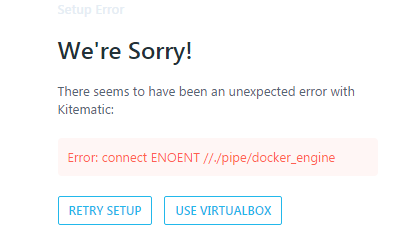
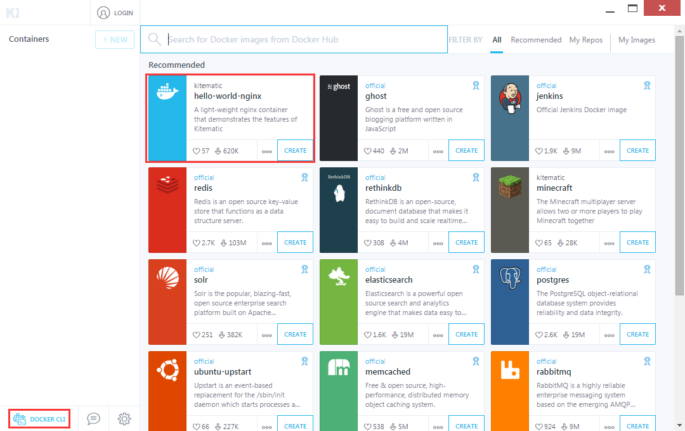

# 3.2 Docker的安装

Docker的安装是比较简单的，笔者原本不想过多提及。但是看到有很多阅读本文的朋友对安装上提出了疑问，故此进行一个安装的总结。

对于Linux用户可以借助其发行版的Linux包管理工具安装，对于Windows和MAC用户相对麻烦一些，笔者下面以Windows7系统为例，讲述安装过程。


## Windows7下的安装

安装包：

| 来源   | 地址                                       | 下载速度 |
| ---- | ---------------------------------------- | ---- |
| 官方   | [https://www.docker.com/products/docker-toolbox](https://www.docker.com/products/docker-toolbox) | 慢    |
| 国内镜像 | [https://get.daocloud.io/toolbox/](https://get.daocloud.io/toolbox/) | 快    |

选择合适版本后（笔者这边使用的是DockerToolbox-1.12.1.exe进行安装），双击打开安装程序，按照安装步骤，把能勾选的都勾选上。安装完成后，重启一下机器，安装就完成了，真的是非常简单。

重启系统后，打开，可能会出现如下视图：



点击USE VIRTUALBOX按钮即可，将会出现如下界面：



至此，Docker已经安装成功。


## CentOS下的安装

Docker容器最早受到RHEL完善的支持是从最近的CentOS 7.0开始的，官方说明是只能运行于64位架构平台，内核版本为2.6.32-431及以上（即 >= CentOS 6.5，运行docker时实际提示3.10.0及以上）。
需要注意的是CentOS 6.5与7.0的安装是有一点点不同的，CentOS 6.x上Docker的安装包叫docker-io，并且来源于Fedora epel库，这个仓库维护了大量的没有包含在发行版中的软件，所以先要安装EPEL，而CentOS 7.x的Docker直接包含在官方镜像源的Extras仓库（CentOS-Base.repo下的[extras]节enable=1启用）。

CentOS 7安装相对简单，下面就CentOS 6.5讲解Docker的安装过程，以下是软件版本：

| Linux版本               | Docker版本 |
| --------------------- | -------- |
| CentOS 6.5 X64（只能X64） | 1.7.1    |


### 升级内核

查看内核版本：

```shell
uname -r
```

结果：`2.6.32-431.el6.x86_64`，不满足上文的需求，故此需要升级内核。

升级步骤：

1. 导入公钥数字证书

   ```shell
   rpm --import https://www.elrepo.org/RPM-GPG-KEY-elrepo.org
   ```

2. 安装ELRepo

   ```shell
   rpm -ivh http://www.elrepo.org/elrepo-release-6-5.el6.elrepo.noarch.rpm
   ```

3. 安装kernel长期版本

   ```shell
   yum --enablerepo=elrepo-kernel install kernel-lt -y 	# lt表示long-term的意思，长期维护版本，也可以将kernel-lt改为kernel-ml，安装主线版本
   ```

4. 编辑grub.conf文件，修改Grub引导顺序，确认刚安装好的内核在哪个位置，然后设置default值（从0开始），一般新安装的内核在第一个位置，所以设置default=0。

   ```shell
   vim /etc/grub.conf

   # 以下是/etc/grub.conf的内容
   default=0		# 修改该值即可
   timeout=5
   splashimage=(hd0,0)/grub/splash.xpm.gz
   hiddenmenu
   title CentOS (3.10.103-1.el6.elrepo.x86_64)
   ```

5. 重启并查看内核版本，将会发现内核已经更新。


### 安装Docker

1. 禁用selinux，因为selinux和LXC有冲突，故而需要禁用

   ```
   vim /etc/selinux/config的内容

   # 以下是/etc/selinux/config的内容
   #     enforcing - SELinux security policy is enforced.
   #     permissive - SELinux prints warnings instead of enforcing.
   #     disabled - No SELinux policy is loaded.
   SELINUX=disabled  # 将SELINUX设为disabled，注意修改后最好重启下机器。
   ```

2. 安装 Fedora EPEL

   ```shell
   yum -y install http://dl.fedoraproject.org/pub/epel/6/x86_64/epel-release-6-8.noarch.rpm
   ```

3. 安装Docker

   ```shell
   yum install -y docker-io
   ```

4. 以守护模式运行Docker

   ```shell
   docker -d
   ```

5. 如果不报错，那就是启动成功了，如果报以下异常：

   ```shell
   docker: relocation error: docker: symbol dm_task_get_info_with_deferred_remove, version Base not defined in file libdevmapper.so.1.02 with link time reference
   INFO[0000] Listening for HTTP on unix (/var/run/docker.sock) 
   ```

   执行以下内容：

   ```shell
   yum upgrade device-mapper-libs
   ```

6. 将Docker开机启动

   ```shell
   chkconfig docker on
   ```

7. 重启机器


## 参考文档

> Windows：https://docs.docker.com/engine/installation/windows/
>
> MAC： https://docs.docker.com/engine/installation/mac/
>
> CentOS：https://docs.docker.com/engine/installation/linux/centos/