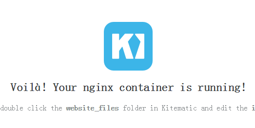

# 3.3 Docker的常用命令

## 准备工作

1. 对于Window用户，请点击Kitematic左下方的DOCKER CLI按钮，在弹出的命令窗体内输入命令，不要在CMD中测试Docker命令。

2. 下载镜像，以kitematic/hello-world-nginx为例：

   ```
   docker pull kitematic/hello-world-nginx
   ```


## 常用命令测试一览表

| 命令                                 | 解释                                       |
| ---------------------------------- | ---------------------------------------- |
| docker images                      | 列表本地所有镜像                                 |
| docker search 关键词                  | 在Docker Hub中搜索镜像                         |
| docker pull 镜像名称                   | 下载Docker镜像                               |
| docker rmi 镜像id                    | 删除Docker镜像。加参数-f表示强制删除。                  |
| docker run 镜像名称                    | 启动Docker镜像                               |
| docker ps                          | 列表所有运行中的Docker容器。该命令参数比较多，-a：列表所有容器；-f：过滤；-q 只列表容器的id。 |
| docker version                     | 查看Docker版本信息                             |
| docker info                        | 查看Docker系统信息，例如：CPU、内存、容器个数等等            |
| docker kill 容器id                   | 杀死id对应容器                                 |
| docker start / stop / restart 容器id | 启动、停止、重启指定容器                             |
| docker build -t 标签名称 目录            | 构建Docker镜像，-t 表示指定一个标签                   |
| docker tag                         | 为镜像打标签                                   |

更多命令，请输入`--help`参数查询；如果想看docker命令可输入`docker --help`；如果想查询`docker run`命令的用法，可输入`docker run --help`。


### docker run

docker run 应该是我们最常用的命令了，这边讲解一下，便于大家入门。

| 参数   | 解释                                       |
| ---- | ---------------------------------------- |
| -d   | 后台运行                                     |
| -P   | 随机端口映射                                   |
| -p   | 指定端口映射<br>格式：<br>ip:hostPort:containerPort<br>ip::containerPort <br>hostPort:containerPort<br>containerPort |

测试：

1. 启动测试镜像`docker pull kitematic/hello-world-nginx`

   ```
   docker run -d -p 91:80 kitematic/hello-world-nginx
   ```

   这边解释下docker run的两个参数：

   ```shell
   -d                           # 后台运行
   -p 宿主机端口:容器端口         # 开放容器端口到宿主机端口
   ```


2. 访问：[http://localhost:91](http://localhost:91) 测试，这里的localhost指的是宿主机的主机名

   


## 说明

由于Docker的入门不是本文章的主要话题，同时入门也是非常简单的，所以不做太多赘述了，我们尽量把话题聚焦在微服务上。如果有疑问的童鞋可以给我提Issue，也可以等待我的“Docker手把手”系列文章。


## TIPS

> 1.  目前网上很多教程还是boot2docker（项目地址：[https://github.com/boot2docker/boot2docker](https://github.com/boot2docker/boot2docker)），该项目已废弃了，笔者不建议使用。
> 2.  如果安装不成功，请按照提示解决一下，譬如开启VT技术等等。Docker的提示是做得非常好的，如果还是安装不上，请给我提Issue，可以远程解决。
> 3.  对于Winodws用户，建议点击Kitematic左下角的DOCKER CLI，在弹出来的控制台输入Docker命令，而不要直接在CMD中输入命令。


## 参考文档：

> http://my.oschina.net/denglz/blog/487332
> https://segmentfault.com/a/1190000000733628
> http://www.oschina.net/translate/nstalling-dockerio-on-centos-64-64-bit
> https://segmentfault.com/a/1190000000735011
> http://www.server110.com/docker/201411/11122.html
> http://dockone.io/article/152
> http://www.open-open.com/lib/view/open1422492851548.html
>
> Docker常用命令：[http://www.infoq.com/cn/articles/docker-command-line-quest/](http://www.infoq.com/cn/articles/docker-command-line-quest/)


