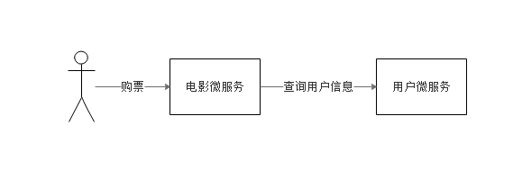

# 3.2.1 服务提供者与服务消费者简介

我们使用服务提供者与服务消费者来描述微服务之间的调用关系。

以下表格简单定义了服务提供者与服务消费者：

| 名词    | 概念                      |
| ----- | ----------------------- |
| 服务提供者 | 服务的被调用方（即：为其他服务提供服务的服务） |
| 服务消费者 | 服务的调用方（即：依赖其他服务的服务）     |

我们还以电影售票系统为例：

图3-1 服务提供者与服务消费者

如图3-1，用户向电影微服务发起了一个购票的请求。在进行购票的业务操作前，电影微服务需要调用用户微服务的接口，查询当前用户的余额是多少，是不是符合购票标准等。在这种场景下，用户微服务就是一个服务提供者，电影微服务则是一个服务消费者。