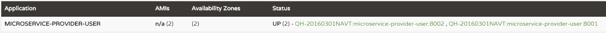

上文我们创建了注册中心，以及服务的提供者microservice-provider-user，并成功地将服务提供者注册到了注册中心上。

要想消费microservice-provider-user的服务是很简单的，我们只需要使用RestTemplate即可，或者例如HttpClient之类的http工具也是可以的。但是在集群环境下，我们必然是每个服务部署多个实例，那么服务消费者消费服务提供者时的负载均衡又要如何做呢？


## 准备工作

1. 启动注册中心：microservice-discovery-eureka
2. 启动服务提供方：microservice-provider-user
3. 修改microservice-provider-user的端口为8001，另外启动一个实例

此时，访问[http://discovery:8761](http://discovery:8761)



可以在Eureka中看到microservice-provider-user有两个实例在运行。

下面我们创建一个新的微服务（microservice-consumer-movie-*），负载均衡地消费microservice-provider-user的服务。


## 负载均衡：Ribbon

### Ribbon介绍

Ribbon是Netflix发布的开源项目，主要功能是提供客户端的软件负载均衡算法，将Netflix的中间层服务连接在一起。Ribbon客户端组件提供一系列完善的配置项如连接超时，重试等。简单的说，就是在配置文件中列出Load Balancer后面所有的机器，Ribbon会自动的帮助你基于某种规则（如简单轮询，随即连接等）去连接这些机器。我们也很容易使用Ribbon实现自定义的负载均衡算法。简单地说，Ribbon是一个客户端负载均衡器。


### Ribbon代码示例

创建一个Maven项目，并在pom.xml中加入如下内容：

```xml

```

启动类：MovieRibbonApplication.java。使用@LoadBalanced注解，为RestTemplate开启负载均衡的能力。

```java

```

实体类：User.java

```java

```

Ribbon的测试类：TestRibbonService.java

```java

```

controller：TestRibbonController.java

```

```

application.yml

```yaml

```

启动后，访问多次[http://localhost:8011/ribbon/1](http://localhost:8011/ribbon/1)，返回结果：

```json

```

然后打开两个microservice-provider-user实例的控制台，发现两个实例都输出了类似如下的日志内容：

```

```

至此，我们已经通过Ribbon在客户端侧实现了均衡负载。


## Feign

### Feign介绍

Feign是一个声明式的web service客户端，它使得编写web service客户端更为容易。创建接口，为接口添加注解，即可使用Feign。Feign可以使用Feign注解或者JAX-RS注解，还支持热插拔的编码器和解码器。Spring Cloud为Feign添加了Spring MVC的注解支持，并整合了Ribbon和Eureka来为使用Feign时提供负载均衡。

>翻译自：[http://projects.spring.io/spring-cloud/docs/1.0.3/spring-cloud.html#spring-cloud-feign](http://projects.spring.io/spring-cloud/docs/1.0.3/spring-cloud.html#spring-cloud-feign)


### Feign示例

创建一个Maven项目，并在pom.xml添加如下内容：

```xml
<?xml version="1.0" encoding="UTF-8"?>
<project xmlns="http://maven.apache.org/POM/4.0.0" xmlns:xsi="http://www.w3.org/2001/XMLSchema-instance"
	xsi:schemaLocation="http://maven.apache.org/POM/4.0.0 http://maven.apache.org/xsd/maven-4.0.0.xsd">
	<modelVersion>4.0.0</modelVersion>

	<artifactId>microservice-consumer-movie-feign</artifactId>
	<packaging>jar</packaging>

	<parent>
		<groupId>com.itmuch.cloud</groupId>
		<artifactId>spring-cloud-microservice-study</artifactId>
		<version>0.0.1-SNAPSHOT</version>
	</parent>

	<dependencies>
		<dependency>
			<groupId>org.springframework.cloud</groupId>
			<artifactId>spring-cloud-starter-eureka</artifactId>
		</dependency>

		<dependency>
			<groupId>org.springframework.cloud</groupId>
			<artifactId>spring-cloud-starter-feign</artifactId>
		</dependency>

		<dependency>
			<groupId>org.springframework.boot</groupId>
			<artifactId>spring-boot-starter-actuator</artifactId>
		</dependency>
	</dependencies>
</project>
```

启动类：MovieFeignApplication.java

```java
/**
 * 使用@EnableFeignClients开启Feign
 * @author eacdy
 */
@SpringBootApplication
@EnableFeignClients
@EnableDiscoveryClient
public class MovieFeignApplication {
	public static void main(String[] args) {
		SpringApplication.run(MovieFeignApplication.class, args);
	}
}
```

实体类：User.java

```java
public class User {
	private Long id;
	private String username;
	private Integer age;
	...
	// getters and setters
}
```

Feign测试类：UserFeignClient.java。

```java
/**
 * 使用@FeignClient("microservice-provider-user")注解绑定microservice-provider-user服务，还可以使用url参数指定一个URL。
 * @author eacdy
 */
@FeignClient(name = "microservice-provider-user")
public interface UserFeignClient {
	@RequestMapping("/{id}")
	public User findById(@RequestParam("id") Long id);
}
```

Feign的测试类：TestFeignController.java

```java
@RestController
public class TestFeignController {
	@Autowired
	private UserFeignClient userFeignClient;

	@GetMapping("feign/{id}")
	public User test(@PathVariable Long id) {
		User user = this.userFeignClient.findById(id);
		return user;
	}
}
```

application.yml

```yaml
server:
  port: 8012
spring:
  application:
    name: microservice-consumer-movie-feign
eureka:
  client:
    serviceUrl:
      defaultZone: http://discovery:8761/eureka/
  instance:
    preferIpAddress: true
ribbon:
  eureka:
    enabled: true         # 默认为true。如果设置为false，Ribbon将不会从Eureka中获得服务列表，而是使用静态配置的服务列表。静态服务列表可使用：<client>.ribbon.listOfServers来指定。参考：http://projects.spring.io/spring-cloud/docs/1.0.3/spring-cloud.html#spring-cloud-ribbon-without-eureka
    
### 参考：https://spring.io/guides/gs/client-side-load-balancing/
```

同样的，启动该应用，多次访问[http://192.168.0.59:8012/feign/1，我们会发现和Ribbon示例一样实现了负载均衡。


## 代码地址（任选其一）：

Ribbon代码地址：

> [http://git.oschina.net/itmuch/spring-cloud-study/tree/master/microservice-consumer-movie-ribbon](http://git.oschina.net/itmuch/spring-cloud-study/tree/master/microservice-consumer-movie-ribbon)
> [https://github.com/eacdy/spring-cloud-study/tree/master/microservice-consumer-movie-ribbon](https://github.com/eacdy/spring-cloud-study/tree/master/microservice-consumer-movie-ribbon)

Feign代码地址：

> [http://git.oschina.net/itmuch/spring-cloud-study/tree/master/microservice-consumer-movie-feign](http://git.oschina.net/itmuch/spring-cloud-study/tree/master/microservice-consumer-movie-feign)
> [https://github.com/eacdy/spring-cloud-study/tree/master/microservice-consumer-movie-feign](https://github.com/eacdy/spring-cloud-study/tree/master/microservice-consumer-movie-feign)


