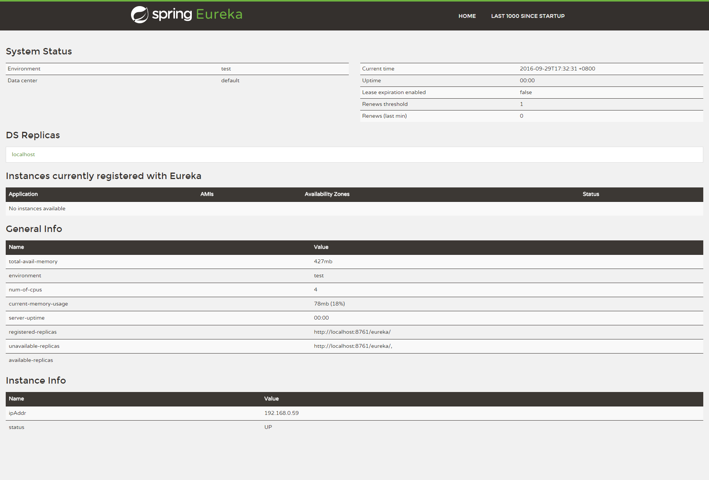

# 4.5.1 Eureka Server代码示例


在Spring Cloud中，实现一个Eureka Server是非常简单的一件事。

* 首先，创建一个Maven工程，并在pom.xml中加入如下内容：

```xml
<project xmlns="http://maven.apache.org/POM/4.0.0" xmlns:xsi="http://www.w3.org/2001/XMLSchema-instance"
  xsi:schemaLocation="http://maven.apache.org/POM/4.0.0 http://maven.apache.org/xsd/maven-4.0.0.xsd">
  <modelVersion>4.0.0</modelVersion>

  <artifactId>microservice-discovery-eureka</artifactId>
  <packaging>jar</packaging>

  <parent>
    <groupId>com.itmuch.cloud</groupId>
    <artifactId>spring-cloud-microservice-study</artifactId>
    <version>0.0.1-SNAPSHOT</version>
  </parent>

  <dependencies>
    <dependency>
      <groupId>org.springframework.cloud</groupId>
      <artifactId>spring-cloud-starter-eureka-server</artifactId>
    </dependency>
  </dependencies>
</project>
```
* 编写启动类，并在其上添加`@EnableEurekaServer` 注解，表示这是一个Eureka Server。

```java
@SpringBootApplication
@EnableEurekaServer
public class EurekaApplication {
  public static void main(String[] args) {
    SpringApplication.run(EurekaApplication.class, args);
  }
}
```


* 最后在配置文件application.yml中添加如下配置：

```yaml
server:
  port: 8761                    # 指定该Eureka实例的端口
eureka:
  client:
    registerWithEureka: false
    fetchRegistry: false
    serviceUrl: 
      defaultZone: http://localhost:8761/eureka/
```

这样就完成了Eureka Server。我们简要说明一下application.yml中的配置项：

`eureka.client.registerWithEureka` ：表示是否将自己注册到Eureka Server，默认为true。由于当前这个应用就是Eureka Server，故而设为false。
`eureka.client.fetchRegistry` ：表示是否从Eureka Server获取注册信息，默认为true。由于这是一个单机的Eureka Server，故而设为false。
`eureka.client.serviceUrl.defaultZone` ：设置与Eureka Server交互的地址，默认是`http://localhost:8761/eureka`  ；多个使用 , 分隔。查询服务和注册服务都需要依赖这个地址。

* 启动工程后，访问：[http://localhost:8761/](http://localhost:8761/) 。我们会发现此时还没有服务注册到Eureka上面，如下图：



该页面展示了Eureka的系统状态、当前注册到Eureka Server上的服务实例、一般信息、实例信息等。我们可以看到，当前还没有任何服务被注册到Eureka Server上。

