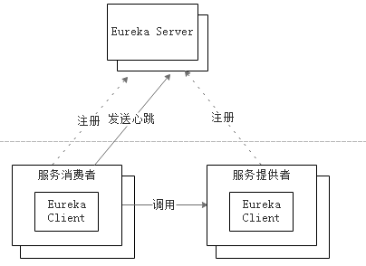

# 4.6.2 目前存在的问题

至此，我们已经实现了一个Eureka Server ；各个微服务启动时，通过Eureka Client将自己的网络信息注册到Eureka Server上。架构图如图4-3所示。

图4-3 微服务架构图

世界似乎更美好了一些。然而现实是，这样的架构离完美还有一定的距离。那么目前的架构存在什么问题呢？

负载均衡。在生产环境，服务消费者与服务提供者都是多实例的。那么在调用的时候，服务消费者如何才能够将请求分摊到多个服务提供者上呢？