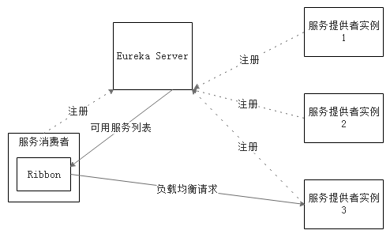

# 4.6.3 客户端侧负载均衡——Ribbon

Ribbon是Netflix发布的一个客户端侧的负载均衡器，它可以对HTTP和TCP客户端的行为进行大量的控制。为服务消费者配置可用服务列表后，Ribbon会自动地帮助我们基于某种负载均衡算法（如轮询、随机等）去请求，我们也可以很方便地为Ribbon实现自定义的负载均衡算法。

当Ribbon与Eureka联合使用时，Ribbon会从Eureka Server中获取服务提供者列表，Ribbon从服务提供者地址列表中，基于负载均衡算法，选择一个提供者实例进行请求。

图4-3展示了Eureka使用Ribbon时候的大致架构：

图4-3 Eureka 与 Ribbon联合使用架构图

