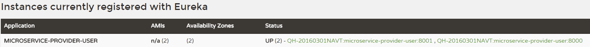

# 4.6.3.1 Ribbon代码示例

在Spring Cloud中，使用Ribbon非常简单。下面我们来为之前编写的电影微服务添加Ribbon的支持。


## 准备工作

1. 启动Eureka Server
2. 启动2个或以上节点的用户微服务，如图4-4所示。



图4-4 Eureka注册多个用户微服务


## 为电影微服务整合Ribbon

* 引入依赖


前文将电影微服务注册到Eureka Server时，添加了`spring-cloud-starter-eureka` ，该依赖已经引入了Ribbon，所以无需手动引入Ribbon的依赖。

* 添加`@LoadBalanced` 注解

回顾之前的代码，在启动类中，实例化RestTemplate的代码如下：

```java
  @Bean
  public RestTemplate restTemplate() {
    return new RestTemplate();
  }
```

为这个方法添加注解`@LoadBalanced` 注解，就可以整合Ribbon，让RestTemplate具备客户端侧负载均衡的能力。

```java
  @Bean
  @LoadBalanced
  public RestTemplate restTemplate() {
    return new RestTemplate();
  }
```

* Service类：

```java
@Service
public class MovieService {
  private static final Logger LOGGER = LoggerFactory.getLogger(MovieService.class);
  @Autowired
  private RestTemplate restTemplate;

  @Autowired
  private LoadBalancerClient loadBalancerClient;

  public User findById(Long id) {
    ServiceInstance serviceInstance = this.loadBalancerClient.choose("microservice-provider-user");
    // 打印当前选择的是哪个节点
    MovieService.LOGGER.info("{}:{}:{}", serviceInstance.getServiceId(), serviceInstance.getHost(), serviceInstance.getPort());
    return this.restTemplate.getForObject("http://microservice-provider-user/" + id, User.class);
  }
}
```

可以看到，请求的地址改成了`http://microservice-provider-user/` 。`microservice-provider-user` 是服务提供者的虚拟主机名（virtual host name），当Ribbon和Eureka联合使用时，会自动将虚拟主机名转换成服务在Eureka Server中注册的IP地址并进行调用。通过LoadBalancerClient的API，可以查询当前选择的是哪个用户微服务节点。


## 测试

多次访问http://localhost:8010/user/1 ，日志如下：

```
2016-10-31 17:49:26.974  INFO 48008 --- [nio-8010-exec-7] c.i.c.study.user.service.MovieService    : microservice-provider-user:192.168.0.59:8001
2016-10-31 17:49:27.007  INFO 48008 --- [nio-8010-exec-9] c.i.c.study.user.service.MovieService    : microservice-provider-user:192.168.0.59:8001
2016-10-31 17:49:27.040  INFO 48008 --- [nio-8010-exec-2] c.i.c.study.user.service.MovieService    : microservice-provider-user:192.168.0.59:8001
2016-10-31 17:50:39.912  INFO 48008 --- [nio-8010-exec-6] c.i.c.study.user.service.MovieService    : microservice-provider-user:192.168.0.59:8000
2016-10-31 17:50:43.827  INFO 48008 --- [nio-8010-exec-8] c.i.c.study.user.service.MovieService    : microservice-provider-user:192.168.0.59:8000
2016-10-31 17:50:45.932  INFO 48008 --- [io-8010-exec-10] c.i.c.study.user.service.MovieService    : microservice-provider-user:192.168.0.59:8000
```

说明已经实现了负载均衡。


##  TIPS 

虚拟主机名与虚拟IP非常类似，如果大家接触过HAProxy或Heartbeat，理解虚拟主机名就非常容易了。如果理解不了虚拟主机名，那可以简单地认为是提供者在Eureka Server中注册的服务名称，因为默认情况下，虚拟主机名和服务名称是一致的。当然也可以通过配置项`eureka.instance.virtual-host-name`  或者`eureka.instance.secure-virtual-host-name` 来指定虚拟主机名。