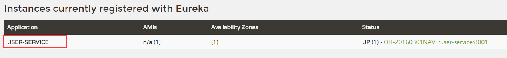

## 关于服务发现

在微服务架构中，服务发现（Service Discovery）是关键原则之一。手动配置每个客户端或某种形式的约定是很难做的，并且很脆弱。Spring Cloud提供了多种服务发现的实现方式，例如：Eureka、Consul、Zookeeper。本文暂时只讲述基于Eureka的服务发现。后续会补上基于Consul和Zookeeper的服务发现。


## Eureka Server示例

创建一个Maven工程，并在pom.xml中加入如下内容：

```xml
<?xml version="1.0" encoding="UTF-8"?>
<project xmlns="http://maven.apache.org/POM/4.0.0" xmlns:xsi="http://www.w3.org/2001/XMLSchema-instance"
	xsi:schemaLocation="http://maven.apache.org/POM/4.0.0 http://maven.apache.org/xsd/maven-4.0.0.xsd">
	<modelVersion>4.0.0</modelVersion>

	<artifactId>discovery-server-eureka</artifactId>
	<name>discovery-server-eureka</name>
	<version>0.0.1-SNAPSHOT</version>
	<description>Spring Cloud Eureka 服务发现</description>
	<packaging>jar</packaging>

	<!-- 这边使用的是最新的spring-boot版本 -->
	<parent>
		<groupId>org.springframework.boot</groupId>
		<artifactId>spring-boot-starter-parent</artifactId>
		<version>1.4.0.RELEASE</version>
	</parent>

	<!-- 必须要添加， -->
	<dependencyManagement>
		<dependencies>
			<dependency>
				<groupId>org.springframework.cloud</groupId>
				<artifactId>spring-cloud-dependencies</artifactId>
				<version>Brixton.SR4</version>
				<type>pom</type>
				<scope>import</scope>
			</dependency>
		</dependencies>
	</dependencyManagement>

	<!-- 添加eureka的server端依赖 -->
	<dependencies>
		<dependency>
			<groupId>org.springframework.cloud</groupId>
			<artifactId>spring-cloud-starter-eureka-server</artifactId>
		</dependency>
	</dependencies>
</project>
```

编写Spring Boot启动程序：通过@EnableEurekaServer申明一个注册中心

```java
/**
 * 使用Eureka做服务发现.
 * @author eacdy
 */
@SpringBootApplication
@EnableEurekaServer
public class EurekaApplication {
	public static void main(String[] args) {
		SpringApplication.run(EurekaApplication.class, args);
	}
}
```

在默认情况下，Eureka会将自己也作为客户端尝试注册，所以在单机模式下，我们需要禁止该行为，只需要在application.yml中如下配置：

```yaml
spring:
  application:
    name: discovery
server:
  port: 8761
eureka:
  client:
    registerWithEureka: false
    fetchRegistry: false
    serviceUrl:
      defaultZone: http://localhost:${server.port}/eureka/


# 参考文档：http://projects.spring.io/spring-cloud/docs/1.0.3/spring-cloud.html#_standalone_mode
# 参考文档：http://my.oschina.net/buwei/blog/618756
```

启动工程后，访问：[http://localhost:8761/](http://localhost:8761/)，如下图。我们会发现此时还没有服务注册到Eureka上面。


工程路径（任选其一）：

```html
http://git.oschina.net/itmuch/spring-cloud-study/tree/master/discovery/discovery-server-eureka
https://github.com/eacdy/spring-cloud-study/tree/master/discovery/discovery-server-eureka
```


## 创建Eureka客户端程序：

创建一个Maven工程，并在pom.xml中添加如下内容：

```xml
<?xml version="1.0" encoding="UTF-8"?>
<project xmlns="http://maven.apache.org/POM/4.0.0" xmlns:xsi="http://www.w3.org/2001/XMLSchema-instance"
	xsi:schemaLocation="http://maven.apache.org/POM/4.0.0 http://maven.apache.org/xsd/maven-4.0.0.xsd">
	<modelVersion>4.0.0</modelVersion>

	<groupId>com.itmuch.cloud</groupId>
	<version>0.0.1-SNAPSHOT</version>
	<artifactId>discovery-client-user</artifactId>
	<description>Spring Cloud Eureka 服务发现 客户端</description>
	<packaging>jar</packaging>

	<!-- 这边使用的是最新的spring-boot版本 -->
	<parent>
		<groupId>org.springframework.boot</groupId>
		<artifactId>spring-boot-starter-parent</artifactId>
		<version>1.4.0.RELEASE</version>
	</parent>

	<!-- 必须要添加 -->
	<dependencyManagement>
		<dependencies>
			<dependency>
				<groupId>org.springframework.cloud</groupId>
				<artifactId>spring-cloud-dependencies</artifactId>
				<version>Brixton.SR4</version>
				<type>pom</type>
				<scope>import</scope>
			</dependency>
		</dependencies>
	</dependencyManagement>

	<!-- 添加eureka的依赖 -->
	<dependencies>
		<dependency>
			<groupId>org.springframework.cloud</groupId>
			<artifactId>spring-cloud-starter-eureka</artifactId>
		</dependency>
	</dependencies>
</project>

```

编写Spring Boot启动程序，通过@EnableDiscoveryClient注解，将服务注册到Eureka上面去

```java
@SpringBootApplication
@EnableDiscoveryClient
public class UserApplication {
	public static void main(String[] args) {
		SpringApplication.run(UserApplication.class, args);
	}
}
```

application.yml配置文件：

```yaml
spring:
  application:
    name: user-service # 指定服务名称是user-service
server:
  port: 8001
eureka:
  client:
    serviceUrl:
      defaultZone: http://localhost:8761/eureka/ # 指向到Eureka的URL
```

测试代码：

```java
/**
 * 作用：测试服务实例的相关内容
 * @author eacdy
 */
@RestController
public class UserController {
	private static final Logger LOGGER = LoggerFactory.getLogger(UserController.class);
	@Autowired
	private DiscoveryClient discoveryClient;

	/**
	 * 注：@GetMapping("/{id}")是spring 4.3的新注解等价于：
	 * @RequestMapping(value = "/id", method = RequestMethod.GET)
	 * 类似的注解还有@PostMapping等等
	 * @param id
	 * @return 本地服务实例的信息
	 */
	@GetMapping("/{id}")
	public ServiceInstance queryById(@PathVariable Integer id) {
		LOGGER.debug("接收的参数：{}", id);
		ServiceInstance localServiceInstance = this.discoveryClient.getLocalServiceInstance();
		return localServiceInstance;
	}
}
```

至此，代码已经编写好。我们依次启动Eureka服务和user-service服务。

访问：[http://localhost:8001/1](http://localhost:8001/1)，返回结果：

```json
{
    "host": "QH-20160301NAVT",
    "port": 8001,
    "metadata": {},
    "uri": "http://QH-20160301NAVT:8001",
    "secure": false,
    "serviceId": "user-service"
}
```

访问：[http://localhost:8761](http://localhost:8761)，如下图。我们会发现user-service服务已经被注册到了Eureka上面了。



工程路径（任选其一）：

```html
http://git.oschina.net/itmuch/spring-cloud-study/tree/master/discovery/discovery-client-user
https://github.com/eacdy/spring-cloud-study/tree/master/discovery/discovery-client-user
```

